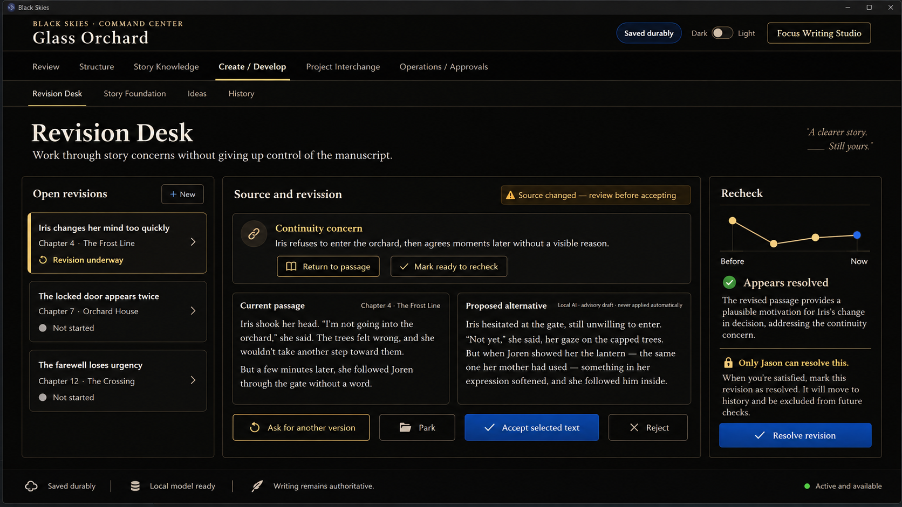
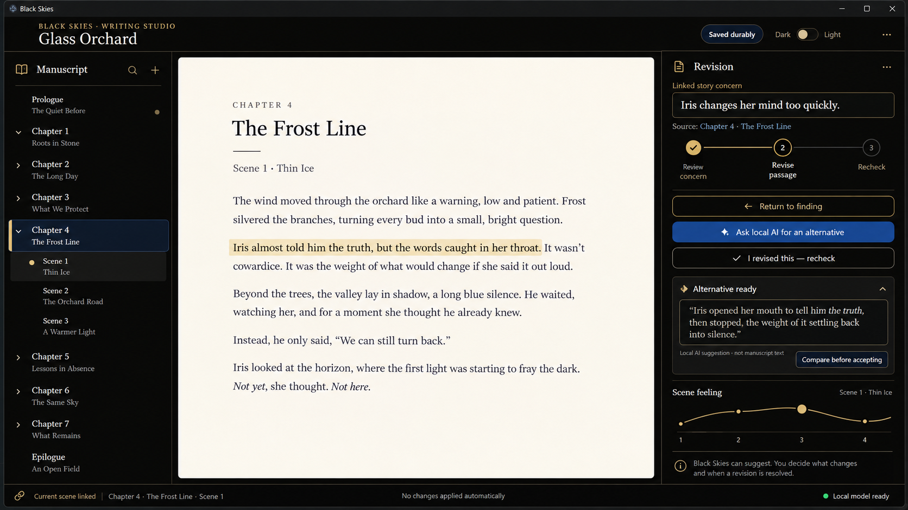

# Program 7 Creation, Revision, And Readiness Charter

## 1. Status And Authority

- Status: accepted Program 7 planning authority and implementation plan;
  planning baseline accepted and clean/synced at user commit
  `994e558d7ede9d9dde4df1a4e268d91be20ebd43`; documentation-only hardening is
  complete in the working tree and awaits a user commit; implementation
  remains gated by a separately recorded implementation worktree and package
- Author decision: Jason, 2026-09-08
- Planning worktree: `C:\Users\gray2\.codex\worktrees\4f0b\black-skies`
- Current branch: `codex/foundation-audit`
- Program 6 closure base: `b6bc85b2cf08d53b5906732e4de030cdb3a7e1b7`
- Scope of this authorization: complete Program 7 through bounded planning,
  implementation, testing, qualification, and repair packages after the
  planning-commit and implementation-worktree gates are satisfied

The `4f0b` worktree is the canonical planning continuation because it contains
the exact accepted Program 6 closure. It is intentionally dirty with the
Program 7 documentation, concept assets, and `Carmilla` source that must be
reviewed together. This charter does not authorize an agent to change branches,
commit, push, package, or make a release claim. The planning-commit gate is
satisfied by Jason's accepted user commit
`994e558d7ede9d9dde4df1a4e268d91be20ebd43`; it was clean and synchronized
with `origin/codex/foundation-audit` before this documentation-only hardening
pass. A separate Program 7 implementation worktree and first package must
still be recorded in this charter and the current open-work register. The next
commit is user-created and user-pushed; agents may prepare documentation but
may not commit, push, or claim an implementation worktree.

The detached `C:\Users\gray2\.codex\worktrees\ecb4\black-skies` checkout is
not the Program 7 planning or implementation tree. It is older and contains
unrelated work that must remain untouched by Program 7.

The exact package order, ownership, dependencies, evidence contract, and stop
conditions are recorded in the
[`Program 7 implementation plan`](program_7_creation_revision_and_readiness_implementation_plan.md).
Its measurable gates are recorded in the
[`Program 7 qualification protocol`](program_7_qualification_protocol.md), and
its visual binding/nonbinding regions, state matrix, and delivered annotated
references are recorded in the
[`Program 7 visual handoff`](program_7_visual_handoff.md).

## 2. Program Promise

Program 6 helps Black Skies understand and present something about the story.
Program 7 helps the author turn that understanding into deliberate action
without transferring authorship.

The complete Program 7 envelope includes:

- acting on Program 6 findings;
- optional Author Intent / Story Foundation;
- Ideation and Premise Discovery;
- proposal-based drafting and rewriting;
- side-by-side comparison and partial acceptance;
- revision-note review, re-evaluation, and resolution; and
- reviewed promotion of accepted candidates through the correct owner.

The first complete workflow is not the whole program. Human Gate 4 may evaluate
the first useful end-to-end workflow, but Program 7 closes only when each
official workflow family is either qualified or explicitly deferred with its
reason, owner, and re-entry trigger.

## 3. Frozen Author Decisions

| Question | Accepted decision |
| --- | --- |
| First workflow | Begin with Program 6 findings and help the author act on a known story problem. |
| Source anchor | Preserve the exact passage or range when possible and the stable scene or unit identity as the fallback anchor. |
| Changed source | Mark the finding or revision item as potentially outdated; never silently reattach or pretend it is current. |
| Resolution authority | Jason alone closes a revision item in the Program 7 product workflow. |
| AI resolution language | AI may say `appears resolved`; it may never set the item to resolved. |
| Recurrence | Create a new related issue rather than silently reopening resolved history. |
| Resolved history | Keep it available and provenance-bearing, but remove it from the ordinary active-work view. |
| No-AI operation | Manual review, editing, recheck, and resolution are mandatory and must independently pass the complete first workflow before any AI result is admitted. |
| Local-AI qualification | The one-model local-AI qualification pilot is mandatory execution work, but admission is conditional: `qwen3:4b` may enter the product path only after every required pilot row passes. A Jason-recorded limitation blocks admission and names re-entry; a host smoke test is not qualification. |
| Provider direction | Local AI remains an explicit route. No local-to-paid or paid-to-local fallback, retry, reroute, or substitution may be silent; unavailable local AI must remain visibly unavailable with a manual path. |
| Long-form corpus | Use the public-domain human-authored Gothic novella `Carmilla` from Project Gutenberg eBook 10007. Preserve the untouched source and license separately from derived test fixtures. |
| Initial local-model candidate | Use the already present `qwen3:4b` Q4_K_M model as the single provisional pilot candidate. Host execution is proved; product quality, performance, harness, safety, and integration remain subject to measured qualification. |
| Surface names | `Revision Desk`, `Story Foundation`, `Ideas`, and `History` remain provisional through later design review. |

A Program 6 finding becomes durable Program 7 work only through an explicit
author action such as `Work on this`. Program 7 does not automatically turn all
findings into tasks, notes, manuscript truth, or canon.

## 4. Program 7 Delivery Sequence

The package identifiers below are planning labels. Implementation package
numbers are assigned only in a later, explicitly recorded execution plan.
Jason's accepted Program 7 coordination preference is to use `GPT-5.6 Luna`
with high reasoning for bounded implementation and computer-operated test
packages, with a stronger coordinator planning, assigning, reviewing, and
qualifying the work. This Program 7-specific decision supersedes the older
generic Terra wording for these packages. Central host files remain serially
owned; Luna agents may not overlap ownership of shared integration surfaces.

### P7-0 - Readiness And Contract Lock

- align the master program, execution plan, authority inventory, open-work
  register, truth ownership, AI lifecycle, and visual direction;
- establish the Readiness Track in Section 5;
- select the long-form evidence source and record its license or ownership;
- inspect the target computer before selecting one local model;
- define the no-AI baseline, model pilot acceptance rubric, and Human Gate 4
  evidence rows; and
- record a clean Program 7 implementation worktree and first owned package
  based on the accepted planning commit
  `994e558d7ede9d9dde4df1a4e268d91be20ebd43`; the worktree and package are not
  yet recorded, and their creation remains user-authorized control work.

### P7-A - Finding To Author Resolution

Deliver the first complete workflow:

1. Jason opens a source-linked Program 6 finding.
2. `Work on this` creates a durable revision item through the revision-note
   owner.
3. The item preserves the finding, exact passage when available, stable unit,
   source version, lens, and provenance.
4. Jason edits normally in Writing Studio.
5. Saving changed source marks earlier evidence potentially outdated.
6. Black Skies rechecks the same concern without silently editing prose.
7. The result may say `appears resolved` or that the concern still appears
   present.
8. Jason alone resolves, dismisses, or parks the item.
9. Later recurrence creates a linked new issue.

This workflow must work fully without AI. It should prove one concrete concern,
one interpretive concern, one protected or masked concern, and one source-drift
case.

### P7-B - Optional Story Foundation

- provide approximately 10 to 15 short, optional author-intent questions;
- allow blank, unknown, undecided, and revised answers;
- keep Story Foundation separate from manuscript truth and canon;
- permit downstream read-only use with visible provenance; and
- never make completion a startup or writing gate.

### P7-C - Revision Proposal And Comparison

- allow an author to request a bounded alternative for selected prose;
- also allow a manually written or pasted alternative so comparison remains
  useful without AI;
- display source, requested purpose, provider or manual origin, protection,
  provenance, and source-currentness;
- show current passage and candidate side by side for rewrites; and
- keep every candidate temporary until explicit acceptance.

### P7-D - Selective Acceptance

- support accept all, accept selected text, edit before acceptance, reject,
  park, and abandon;
- mutate only the explicitly accepted span through Narrative Insertion /
  Narrative Assertion;
- retain original, candidate, edited candidate, and accepted-result
  provenance; and
- never close a finding, note, or Signal merely because prose was accepted.

### P7-E - Ideation And Premise Discovery

- support Idea Seeds, Exploration Branches, Premise Versions, advisory premise
  testing, combinations, intentional ambiguity, and an Idea Library;
- make manual capture, comparison, testing, and promotion first-class;
- allow bounded AI alternatives only when explicitly requested; and
- keep exploration non-truth until author-reviewed promotion.

### P7-F - Reviewed Promotion And Owner Handoff

- route accepted creative intent to Story Foundation;
- route accepted structural candidates to Living Outline;
- route section candidates to Story Unit or the relevant planning owner;
- route accepted prose through Narrative Insertion / Narrative Assertion; and
- route character or lore candidates toward their later Program 8 owners
  without implementing the full card, Binder, or search systems in Program 7.

### P7-G - Integrated History, Maturity, And Closure

- provide bounded, summonable revision and comparison history;
- keep resolved work out of the ordinary active view;
- preserve recurrence links, stale-source handling, protection, and
  provenance;
- qualify Writing Studio and Command Center behavior together;
- validate keyboard access, zoom, theme contrast, recovery, failure, and
  cancellation; and
- complete long-form automated and human qualification before final Program 7
  closure.

## 5. Program 7 Readiness Track

The Readiness Track pulls forward only the evidence and integration needed to
make Program 7 real. It does not absorb Programs 8 or 9.

### RT-1 - Program 6 Integration And Maturity

Program 7 consumes Program 6 findings as source evidence. If real revision use
shows that a finding cannot locate its passage, explain itself in writer-facing
language, survive source change honestly, return to the correct unit, or
support a useful author action, that defect is repaired as a bounded Program 6
integration prerequisite. Program 7 does not reopen Program 6 wholesale or add
new lenses merely to make the feature list larger.

At minimum, integration evidence must cover:

- exact-passage plus scene or unit anchoring;
- current, potentially outdated, protected, and unavailable evidence;
- return-to-source across Writing Studio and detached Command Center;
- manual creation of a revision item from a finding;
- re-evaluation after a saved manuscript change; and
- clear writer-facing language rather than engineering terminology.

### RT-2 - One-Model Local-AI Pilot

Program 7 brings forward a bounded local-model pilot because revision and
ideation cannot be judged honestly if AI remains an untested future promise.
The pilot is limited to one model selected after a hardware and runtime audit.

The first admitted tasks are:

1. produce a bounded rewrite candidate for an author-selected passage;
2. re-evaluate one revision and emit only an advisory `appears resolved` or
   `still appears present` assessment; and
3. offer bounded premise alternatives after explicit author request.

The pilot is mandatory before Human Gate 4; it is not optional merely because
the no-AI path is shippable. Admission is conditional on measured evidence,
not on host feasibility or a single successful prompt. Every mandatory pilot
row must pass for local AI to be admitted. The pilot must prove
visible model identity (`qwen3:4b`), loopback-local execution, explicit author
invocation, source-bounded packaging, protected-content enforcement,
cancellation, timeout and failure recovery, honest unavailable state, bounded
resource/latency behavior, structured harness repeatability, and no manuscript
or resolution mutation. The pilot must run against both the baseline and
revised `Carmilla` snapshots and the same task set must also be executable
manually without AI. A failed, timed-out, cancelled, unavailable, or
unadmitted local run must stop at a visible state and preserve the manual path;
no local-to-paid fallback, paid-to-local fallback, retry, or reroute may be
silent. The full provider router, multiple-model management, spending,
background queues, replacement, and production model lifecycle remain Program
9 work.

#### RT-2 admission and qualification contract

The qualification packet must report the exact candidate commit, model tag and
digest, Ollama version, hardware, corpus snapshot, prompt/task identifier,
request/response timestamps, cancellation or timeout reason, token and memory
observations when available, and artifact paths. The following are mandatory
pilot rows, with no aggregate score allowed to hide a failure:

| Pilot row | Passing evidence required | Admission consequence |
| --- | --- | --- |
| Local identity and route | UI and receipt name `qwen3:4b`; route is loopback Ollama; no outbound provider request is observed | Fail blocks admission |
| Manual parity | The same rewrite, recheck, and premise tasks can be completed with AI disabled and no capability loss in review, editing, recheck, or Jason resolution | Fail blocks the no-AI gate and Human Gate 4; local AI cannot compensate |
| Protected content | Protected sentinel is absent from model payload, logs, receipts, DOM, IPC traces, temp files, history, and screenshots | Any leak blocks admission and requires incident review |
| Bounded output | Rewrite stays within the selected passage and requested purpose; no direct mutation, canonization, or resolution transition occurs | Fail blocks admission |
| Recheck authority | Model emits only advisory `appears resolved` / `still appears present`; only Jason can resolve | Any authority violation blocks admission |
| Cancellation and timeout | Cancelled and timed-out runs terminate visibly, leave no partial mutation, and return to manual action | Fail blocks admission |
| Failure and unavailable | Offline, model-missing, malformed, and provider-error states are honest, recoverable, and never silently rerouted | Fail blocks admission |
| Repeatability and resources | The fixed task set completes in the documented latency/resource envelope on repeated runs, with no unexplained flake | Unresolved flake blocks admission |

Jason may record a bounded limitation only by naming the exact row, evidence,
impact, and re-entry trigger; that disposition does not count as a passing row
and does not admit local AI. Until every mandatory row passes, local AI is
visibly **unadmitted** and the complete no-AI path remains the only accepted
product route.

#### 2026-09-08 Hardware And Runtime Inventory

The authorized read-only inventory found:

- Dell Inspiron 15 3525;
- AMD Ryzen 7 5825U, 8 cores and 16 logical processors;
- 15.4 GB usable RAM;
- integrated AMD Radeon graphics reporting 0.5 GB dedicated adapter memory;
- Windows 11 Home, 64-bit;
- 119.6 GB free on a 459.3 GB system drive; and
- Ollama client `0.13.0` installed at
  `C:\Users\gray2\AppData\Local\Programs\Ollama\ollama.exe`.

Existing Ollama manifests include `codellama:latest`,
`deepseek-coder:6.7b`, `qwen2.5:1.5b`, `qwen2.5-coder:7b`, `qwen3:4b`, and
`qwen3:8b`. The selected provisional pilot candidate is `qwen3:4b`, already
present as a 4.0B Q4_K_M GGUF with a `2497280480` byte model layer. It is a
better first fit for this 16 GB, integrated-graphics computer than beginning
with the installed 8B model. Selection is not qualification.

A later independent read-only recheck proved Ollama `0.13.0` healthy on
loopback at `127.0.0.1:11434`: the root endpoint returned `Ollama is running`,
TCP loopback succeeded, `/api/tags` returned all six installed models,
`ollama show` succeeded for both `qwen3:4b` and `qwen3:8b`, and
`ollama run qwen3:4b "Reply with exactly OK."` returned exactly `OK`.
`ollama ps` then showed `qwen3:4b` loaded on CPU, and server logging showed a
loopback-only binding. No settings, model files, logs, installs, or repository
files were changed by that inspection.

Historical GUI logs show a transient startup race in which the GUI queried
`/api/tags` before the listener was ready. The earlier log-rotation and
`app.log` access denial occurred only in the Codex restricted shell running as
`jasongray\codexsandboxoffline`; the normal user-owned Ollama runtime writes
logs successfully. There is no demonstrated Ollama ACL or model-store defect.
Host feasibility is therefore proved. Model quality, latency, memory and other
resource behavior, cancellation, timeout behavior, structured harness
behavior, protected-content enforcement, and Black Skies integration remain
unqualified. The successful one-line prompt is a host diagnostic, not Program
7 product qualification.

### RT-3 - Long-Form Evidence Corpus

Program 7 requires a 20,000 to 30,000 word human-authored testing project.
Source preference is:

1. a Jason-owned draft that is safe to use;
2. a clearly licensed public-domain work converted into a Black Skies project;
3. a purpose-written testing novella; or
4. AI-generated prose only as a separately labeled load fixture, never as the
   sole evidence for voice, usefulness, or revision quality.

Jason selected `Carmilla` by Joseph Sheridan Le Fanu from Project Gutenberg
eBook 10007 on 2026-09-08. Project Gutenberg identifies it as public domain in
the United States. The downloaded, unmodified UTF-8 source contains `28199`
human-authored body words, a prologue, and sixteen chapters. Its source,
license, byte count, and SHA-256 evidence are recorded in the
[`Carmilla` corpus manifest](../../sample_project/program_7_corpus/carmilla/README.md).

The corpus must include chapters, scenes, stable units, varied dialogue and
description, several characters and relationships, timeline dependencies,
planned emotional movement, differing pacing and pressure, continuity facts,
at least one protected section, and documented story problems.

Maintain at least two known snapshots:

- a baseline containing documented concerns; and
- a revised version that fixes some concerns, leaves others, changes source
  wording, and introduces one related recurrence.

A separate answer key records expected source units, seeded or known concerns,
expected stale transitions, facts a rewrite must preserve, protected material,
and concerns expected to remain. Automated model tests evaluate boundaries and
invariants, not one exact prose answer.

## 6. Surface And Interaction Direction

### Command Center - Create / Develop

`Create / Develop` is the primary Program 7 home. Its planned writer-facing
sections are:

- `Revision Desk`
- `Story Foundation`
- `Ideas`
- `History`

These names are provisional. They express the intended information structure
but may be replaced with clearer writer-facing terms during later design
review.

Revision Desk presents open revisions, the linked finding and source, current
and proposed passages, explicit candidate actions, and a recheck summary. A
small before-and-now graph may support re-evaluation when it communicates a
real lens change. `Appears resolved` must sit beside the explicit statement
`Only Jason can resolve this.`

### Writing Studio

Writing Studio remains manuscript-first. A quiet contextual Revision drawer
may show the linked concern, the active `Review concern -> Revise passage ->
Recheck` progression, return-to-finding, request-alternative, comparison, and
recheck actions. A compact lens graph may appear only as supporting context.
Deep history, queues, and full ideation management remain in Command Center.

### Other Existing Surfaces

- Story Knowledge retains Program 6 lenses and gains only bounded handoffs such
  as `Work on this` and `Open revision`.
- Operations / Approvals presents model availability, model identity, local or
  outbound disclosure, protection posture, cancellation, failure, and run
  receipts without becoming the ordinary revision workspace.
- Structure receives reviewed structural promotions without transferring
  Outline ownership to Program 7.

## 7. Program 7 Visual Concepts

The two accepted discussion concepts are preserved as composition references:

The first concept establishes the `Create / Develop` workspace, four-section
Program 7 navigation, open-revision list, source and revision comparison,
explicit local-AI disclosure, before-and-now recheck graph, and Jason-only
resolution control. The second establishes a page-first Writing Studio with a
restrained Revision drawer, linked passage, three-step progression, local-AI
alternative preview, compare-before-accepting action, and small supporting
scene-feeling graph.

These images are directional product evidence, not pixel specifications and
not authority to add new colors, fonts, truth owners, model routes, or automatic
actions. In particular, the bright manuscript-page rectangle and bright-blue
actions shown in the concepts create no light-page, palette, or text-token
exception. Until Jason separately changes the visual authority, the true-black
manuscript foundation, one-muted-violet accent rule, existing semantic colors,
and verified contrast requirements govern implementation.

### Annotated visual handoff

The concepts are screenshot/mockup references, not unannotated implementation
targets. The following numbered callouts are the minimum handoff for any later
UI package; each must be represented in the package's dark and light
screenshots and tied to an evidence row:

| Callout | Concept region | Required meaning and state coverage |
| --- | --- | --- |
| V1 | `Create / Develop` navigation | Writer-facing navigation only; active, hover, keyboard-focus, collapsed/narrow, and no-project states remain readable. |
| V2 | Open revision list | Source-linked items show current, potentially outdated, protected, unavailable, resolved-history, empty, and recurrence states without color-only meaning. |
| V3 | Source/candidate comparison | Source, candidate, manual alternative, provider identity, provenance, and protection are explicit; accept/reject/edit/park remain distinct and disabled reasons are visible. |
| V4 | Recheck summary and graph | Graph is supporting context only; its lens owner, snapshot/time axis, and decision purpose are named. Empty, loading, failed, stale, and unavailable states are required. |
| V5 | Jason-only resolution control | `Appears resolved` is advisory; `Only Jason can resolve this` remains adjacent; AI, accepted prose, and recheck never close the item. |
| V6 | Writing Studio Revision drawer | Manuscript remains primary; `Review concern -> Revise passage -> Recheck` is visible; manual alternative and local-AI-unavailable paths remain available. |
| V7 | Local-AI disclosure | Model identity, local route, protection status, cancellation, timeout, failure, and no-silent-fallback state are visible; `Local model ready` alone is insufficient. |
| V8 | Theme and viewport matrix | Capture true-black dark, qualified light, narrow width, 200% zoom, keyboard focus, reduced-motion, and detached-window variants; the bright page and blue action create no new token. |

No graph, label, status, or action may be implemented solely because it appears
in a concept image. A package is visually incomplete until its screenshot set
shows the required state transitions, annotations, contrast results, and the
manual/no-AI alternative.

## 8. Text Color And Contrast Non-Regression Rule

Program 7 introduces **no new font or text color token**. It must reuse the
current qualified Black Skies text colors and semantic states. The low-contrast
light-gray treatment removed during Program 6 must not return.

Specifically:

- no pale or light-gray body text, headings, field labels, button text,
  placeholders, metadata, or status copy may be placed on a light surface or
  any background where it becomes difficult to read;
- dark surfaces use the existing high-contrast warm off-white and established
  readable supporting-text roles;
- light surfaces use the existing dark readable text roles;
- required instructions and interactive labels may not be dimmed through a
  muted color or opacity merely to create visual hierarchy;
- disabled, stale, advisory, and secondary states use an icon, border, label,
  or pattern as well as color, while their text remains readable;
- the blue, gold, cream, warning, success, and other emphasis visible in the
  concepts must map to already accepted semantic roles rather than create new
  font colors; and
- every Program 7 UI batch must include computed contrast checks and human
  review in both dark and light themes. A recurrence of the rejected pale-gray
  text is a blocking regression, not a polish deferral.

## 9. Qualification And Human Evidence

Each implementation slice must follow the existing contract/persistence,
owner bridge, UI workflow, end-to-end evidence, and repair/regression rhythm.
Program 7 evidence must include:

- focused shared, main, renderer, service, and Electron coverage appropriate to
  the slice;
- currentness, anchoring, protected-content, source-return, and manuscript-
  sovereignty regressions;
- local-model unavailable, success, failure, cancellation, and no-silent-
  fallback cases once the pilot is authorized;
- long-form performance and correctness evidence against the accepted corpus;
- dark and light theme contrast, keyboard, zoom, focus, and detached-window
  review; and
- annotated visual evidence covering callouts V1-V8, including empty,
  unavailable, stale, failed, cancelled, protected, and no-AI/manual states;
- unpacked and installed NSIS qualification for the accepted candidate, with
  the same no-AI and admitted-local-AI claims bound to the exact artifact; and
- Jason's concrete evidence notes for the Human Gate 4 rows.

Agents perform exhaustive objective and UI prechecks and record one evidence
row per check with the exact commit, package, environment, corpus snapshot,
precondition, action, expected result, observed result, artifacts, and one of
`Pass`, `Fail`, or `Uncertain`. `Pass` requires complete objective evidence;
ambiguity, flaky evidence, blocked capture, or subjective judgment is
`Uncertain` and never counts as a pass. Jason reviews every `Fail` and
`Uncertain`, every authority-sensitive or genuinely subjective row, and a
bounded deterministic sample of agent passes. Agent execution and an agent's
`appears resolved` assessment are precheck evidence, never human acceptance or
product resolution. Jason alone judges usefulness, voice preservation,
interruption cost, naming, aesthetics, tolerable wait, and actual resolution.

Human Gate 4 occurs only after the complete no-AI workflow is independently
mechanically qualified and human-reviewed, and after the mandatory local-AI
pilot has executed with every row's outcome recorded. The local-AI route may
be admitted only when every mandatory row passes; a Jason-recorded limitation
keeps it unadmitted and does not block the independently accepted no-AI route.
Host feasibility alone never admits local AI. Passing the gate validates the
foundation; it does not silently close the remaining Program 7 workflow
families.

## 10. Explicit Nonclaims And Next Decisions

This charter does not claim that:

- Program 7 implementation has started;
- the selected `qwen3:4b` candidate is product-qualified merely because host
  execution succeeded;
- the downloaded `Carmilla` source has been converted into a Black Skies
  project, versioned corpus, or answer key;
- the concept images are implemented UI;
- Program 6 has new runtime work;
- Program 8 Binder, search, cards, files, memory, or interchange are active;
- Program 9 provider routing, cost, background work, or model lifecycle is
  active; or
- Human Gate 4 has begun or passed.

The accepted planning baseline is user commit
`994e558d7ede9d9dde4df1a4e268d91be20ebd43`, clean and synchronized before this
documentation-only hardening pass. The next minimum execution action is to
record a separate implementation worktree and explicitly owned package based
on that commit; the next commit and push remain user-only. The derived
`Carmilla` project and answer key, pilot evidence, and exact Human Gate 4 rows
remain package-level work. Program 7 surface names remain provisional until
Jason freezes them later.
