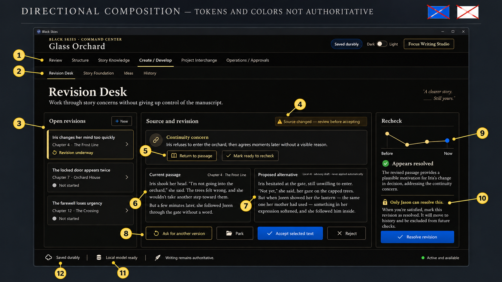
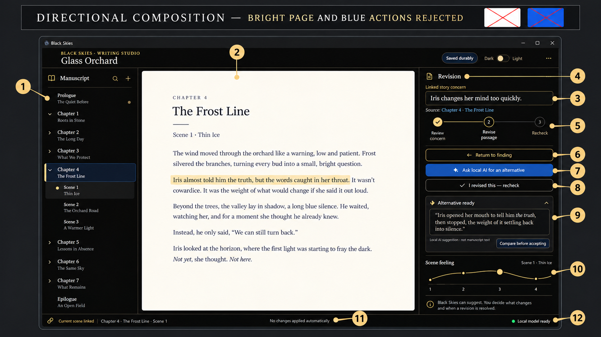
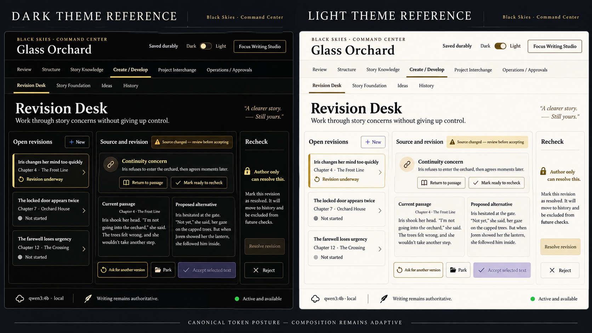
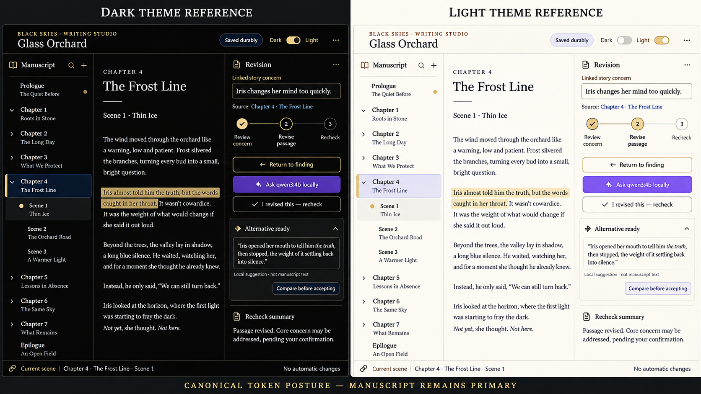

# Program 7 Visual Handoff And Qualification Contract

## 1. Status, purpose, and authority

- Status: `documentation-only hardening complete in the working tree; implementation reference; not a pixel specification`
- Program: `Program 7 - Creation, Revision, And Readiness`
- Governing visual authority: [`control_point_1_visual_design_foundation.md`](control_point_1_visual_design_foundation.md)
- Product authority: [`program_7_creation_revision_and_readiness_charter.md`](program_7_creation_revision_and_readiness_charter.md)
- Execution authority: [`program_7_creation_revision_and_readiness_implementation_plan.md`](program_7_creation_revision_and_readiness_implementation_plan.md)
- Source concepts:
  - [`program_7_revision_desk_concept.png`](program_7_assets/program_7_revision_desk_concept.png)
  - [`program_7_writing_studio_revision_concept.png`](program_7_assets/program_7_writing_studio_revision_concept.png)
- Annotated review overlays:
  - [`program_7_revision_desk_annotated.png`](program_7_assets/program_7_revision_desk_annotated.png)
  - [`program_7_writing_studio_revision_annotated.png`](program_7_assets/program_7_writing_studio_revision_annotated.png)
- Canonical token-posture references:
  - [`program_7_revision_desk_dark_light_reference.png`](program_7_assets/program_7_revision_desk_dark_light_reference.png)
  - [`program_7_writing_studio_dark_light_reference.png`](program_7_assets/program_7_writing_studio_dark_light_reference.png)
- Surface names `Revision Desk`, `Story Foundation`, `Ideas`, and `History` remain provisional until Jason completes annotated human visual review.
- This handoff does not authorize runtime, image, test, dependency, packaging, or model changes. It defines what those later changes must prove.

The concepts are useful composition references. They are not authority for colors,
fonts, page treatment, component geometry, truth ownership, provider routing,
automatic acceptance, or graph inclusion. A later implementation may improve the
composition while retaining the ownership and workflow contracts below.

## 2. Non-negotiable visual posture

The visual foundation wins whenever a concept conflicts with it.

- The default Writing Studio manuscript canvas is true black or visually indistinguishable black, with warm readable prose.
- The manuscript is not a bright white or cream page rectangle in the default dark experience.
- The light theme is a deliberate qualified theme using existing dark readable text roles; it is not the concept's bright page treatment copied into dark mode.
- Primary actions use existing semantic roles and the approved muted-violet accent direction. The bright-blue buttons visible in both concepts must not be copied.
- No new font, text-color, neon, gradient, glow, glass, starfield, or decorative graph token is introduced.
- Required labels, warnings, source state, local-model state, and action consequences remain readable at supported zoom and in both themes.
- A manual route is always visible when a local-AI route is offered. No-AI operation is complete and shippable without local AI.
- Local AI is an explicit request, never a silent fallback. An unavailable, cancelled, timed-out, failed, or rejected local run leaves the manual route usable and does not alter manuscript truth.
- Elevation, color, proximity, and chart position never imply ownership or acceptance authority.

## 3. How to read the visual annotations

Each annotation has a stable ID used by later design review, component tests,
visual fixtures, and Human Gate 4 evidence. `B` means binding product or visual
contract; `N` means nonbinding directional evidence. `Owner` names the source of
truth, not the component that renders it. `Action` is the permitted user action,
not an implementation API.

| Field | Meaning |
| --- | --- |
| `V-RD-*` / `V-WS-*` | Revision Desk / Writing Studio visual region identifier |
| `B` | Must be preserved or a documented authority decision is required |
| `N` | Concept-only arrangement, copy, dimensions, or decorative treatment |
| Owner | Durable state owner or explicitly `projection only` |
| Action | Allowed author action and its boundary |
| A11y | Required accessible name, focus, target, announcement, or non-color cue |
| Test IDs | Minimum later automated/manual evidence references |

## 4. Revision Desk concept annotation map

Source: `program_7_revision_desk_concept.png`.

The numbered overlay covers the execution-critical regions. Its numbers map to
the stable IDs below as follows:

| Overlay number | Stable region |
| --- | --- |
| `1` | `V-RD-02` primary navigation |
| `2` | `V-RD-03` Program 7 navigation |
| `3` | `V-RD-05` open revisions |
| `4` | `V-RD-06` stale/currentness warning |
| `5` | `V-RD-07` source concern and return action |
| `6` | `V-RD-08` current passage |
| `7` | `V-RD-09` proposed alternative |
| `8` | `V-RD-10` candidate actions |
| `9` | `V-RD-11` optional recheck visualization |
| `10` | `V-RD-12` author-only resolution |
| `11` | `V-RD-13` local-model status |
| `12` | `V-RD-13` durable-save and writing-authority status |

| ID | Visible region and observed concept content | Binding / nonbinding disposition | Owner and action | Accessibility and test IDs |
| --- | --- | --- | --- | --- |
| `V-RD-01` | Top identity bar: `BLACK SKIES`, project name, save badge, theme switch, and `Focus Writing Studio` | `B` for orientation, save truth, theme access, and return path; `N` for exact wording and pixels | Project/session owner projects identity and durable-save state. Author may switch theme or return to Writing Studio. | Landmarks and headings; theme control has text label and persisted state; `RD-ORIENT-01`, `A11Y-THEME-01` |
| `V-RD-02` | Primary navigation: Review, Structure, Story Knowledge, Create / Develop, Project Interchange, Operations / Approvals | `B` for accepted workspace families; `N` for exact tab spacing and active underline | Command Center router owns navigation; navigation never mutates domain truth. | Keyboard roving/tab order, current-page announcement, visible focus; `RD-NAV-01`, `A11Y-NAV-01` |
| `V-RD-03` | Secondary navigation: Revision Desk, Story Foundation, Ideas, History | `B` only as provisional orientation; names require Jason's annotated review; `N` for count and order | Command Center projects owner-routed work. Navigation only. | Names are available to assistive technology; no icon-only tabs; `RD-NAV-02`, `A11Y-NAV-02` |
| `V-RD-04` | Intro title and literary quote | `N` copy, quote, and exact placement; `B` that the active task is named plainly | No durable owner. No action beyond orientation. | One heading; decorative quote excluded from reading order if not informative; `RD-ORIENT-02` |
| `V-RD-05` | Open revisions list with `New`, selected concern, status, source chapter, and other concerns | `B` for author-owned list, source location, lifecycle label, and new-work route; `N` cards, chevrons, and wording | Feedback Notes / Revision Resolution owns revision item. Author selects, starts, parks, or opens work; `New` creates no hidden AI work. | List semantics, selected item announced, status text plus icon/pattern, target >= 44 CSS px; `RD-LIST-01`, `A11Y-LIST-01` |
| `V-RD-06` | Source and revision header with `Source changed — review before accepting` | `B` stale/current warning and accept guard; `N` amber pill geometry | Source/currentness owner provides state. Author must review or refresh; no accept while stale unless an explicit safe contract permits it. | Warning is text plus icon, announced once, focusable remedy; `RD-STALE-01`, `A11Y-STALE-01` |
| `V-RD-07` | Linked concern card with source-linked finding and `Return to passage` / `Mark ready to recheck` | `B` source binding, author action boundary, and recheck transition; `N` chain icon and copy style | Program 6 finding projection plus Feedback Notes owner. Author returns to source or requests deterministic recheck. | Buttons have verbs and destination; source location is keyboard reachable; `RD-SOURCE-01`, `RD-RECHECK-01` |
| `V-RD-08` | Current passage comparison pane | `B` current source text remains distinct, read-only, and source-linked; `N` exact serif choice and pane width | Manuscript truth owner supplies immutable current snapshot. Author can inspect/copy according to policy, not mutate here. | Read-only label, selection order, text zoom, no truncation without reveal; `RD-COMPARE-01`, `A11Y-COMPARE-01` |
| `V-RD-09` | Proposed alternative pane labeled `Local AI · advisory draft · never applied automatically` | `B` origin, advisory status, no-auto-apply, and distinct candidate treatment; `N` exact prose and panel framing | Revision Candidate owner stores manual or explicit local-AI candidate. Author compares, edits, accepts selected text, rejects, or parks; acceptance goes through manuscript owner. | Origin and advisory labels are text; protected text never appears; `RD-CANDIDATE-01`, `PROTECT-UI-01`, `A11Y-CANDIDATE-01` |
| `V-RD-10` | Bottom candidate actions: ask for another version, park, accept selected text, reject | `B` explicit separate actions and no implicit mutation; `N` exact order and button color | Candidate owner handles lifecycle; manuscript owner handles accepted text; author confirms. | Full keyboard operation, destructive/reversible wording, disabled reason, focus remains after action; `RD-ACTIONS-01`, `A11Y-ACTIONS-01` |
| `V-RD-11` | Recheck panel with before/now line graph and `Appears resolved` summary | `B` only if a qualified lens owner, data contract, and decision use exist; otherwise omit (see Section 10); `N` points, colors, animation, and chart styling | Recheck projection owns deterministic evidence. AI can only report appearance; Jason resolves. | Every point has text equivalent, table/list alternative, and no color-only meaning; `RD-RECHECK-VIS-01`, `A11Y-GRAPH-01` |
| `V-RD-12` | `Only Jason can resolve this` and resolve control | `B` author-only resolution and explicit consequence; `N` lock icon and blue button treatment | Feedback Notes / Revision Resolution owns state; Jason alone resolves. | Disabled/unauthorized users receive reason and remedy; confirmation states preserve focus; `RD-RESOLVE-01`, `A11Y-RESOLVE-01` |
| `V-RD-13` | Bottom status strip: durable save, local model ready, writing authoritative, active/available | `B` truthful save, model availability, manuscript sovereignty, and route state; `N` icon choice and exact placement | Session/save owner, local inference service projection, and manuscript owner each supply their own state. | Never rely on dot/icon alone; status text in live region only for changes; `RD-STATUS-01`, `A11Y-STATUS-01` |

## 5. Writing Studio concept annotation map

Source: `program_7_writing_studio_revision_concept.png`.

| Overlay number | Stable region |
| --- | --- |
| `1` | `V-WS-02` manuscript navigator |
| `2` | `V-WS-03` manuscript canvas |
| `3` | `V-WS-04` linked source concern |
| `4` | `V-WS-04` revision drawer identity |
| `5` | `V-WS-04` three-step progression |
| `6` | `V-WS-04` return-to-finding action |
| `7` | `V-WS-05` explicit local-AI request |
| `8` | `V-WS-06` mandatory no-AI recheck |
| `9` | `V-WS-07` candidate preview and comparison |
| `10` | `V-WS-08` omitted-unless-qualified Visualizer foundation |
| `11` | `V-WS-09` no-automatic-change status |
| `12` | `V-WS-09` local-model status |

| ID | Visible region and observed concept content | Binding / nonbinding disposition | Owner and action | Accessibility and test IDs |
| --- | --- | --- | --- | --- |
| `V-WS-01` | Top shell with project title, durable-save badge, theme switch, and overflow menu | `B` project identity, save truth, theme access, and bounded menu; `N` exact placement and ellipsis | Project/session owner projects state. Author changes theme, layout, or safe project actions. | Named landmarks; overflow is a labeled button; `WS-ORIENT-01`, `A11Y-THEME-02` |
| `V-WS-02` | Manuscript navigator with Manuscript heading, search, add, chapters, and selected scene | `B` discoverable manuscript context and current selection; `N` tree indentation, chapter copy, and icon geometry | Manuscript structure owner owns navigation; selecting locates text and does not change truth. | Tree semantics, expand/collapse keys, current location announcement, target >= 44 CSS px; `WS-NAV-01`, `A11Y-TREE-01` |
| `V-WS-03` | Central manuscript page with chapter, scene, prose, and highlighted sentence | `B` manuscript-first canvas, source selection, and non-destructive highlight; `N` cream page, drop shadow, exact type, and page dimensions | Manuscript truth owner owns prose. Author edits directly; highlight links to a finding/candidate without applying it. | Reading order, text zoom/reflow, selection preserved, no forced page rectangle in dark mode; `WS-MANUSCRIPT-01`, `A11Y-PROSE-01` |
| `V-WS-04` | Right Revision drawer header, linked concern, source location, and three-step progression | `B` contextual source link and `Review concern -> Revise passage -> Recheck` progression; `N` exact step circles and copy | Revision owner projects lifecycle. Author returns to finding, revises, or rechecks. | Progress has text labels, current step announced, no color-only step status; `WS-DRAWER-01`, `A11Y-PROGRESS-01` |
| `V-WS-05` | `Ask local AI for an alternative` action | `B` explicit opt-in local route and manual alternative alongside it; `N` blue fill, sparkle icon, and exact button copy | Local inference service receives bounded explicit request; no-AI route remains complete. | Button states: available, unavailable, loading, cancelled, failed; `WS-AI-01`, `AI-OPTIN-01`, `A11Y-AI-01` |
| `V-WS-06` | Manual action `I revised this — recheck` | `B` manual-first path and deterministic recheck; `N` exact button styling | Author edits manuscript and requests recheck; no model required. | Keyboard reachable before AI action in no-AI mode, clear consequence, `WS-MANUAL-01`, `AI-OPTIONAL-01` |
| `V-WS-07` | Alternative-ready card with candidate prose and `Compare before accepting` | `B` candidate remains advisory and separate from manuscript text until explicit acceptance; `N` card border, quote copy, and width | Revision Candidate owner stores candidate; author compares, edits, accepts selected text, rejects, or parks. | Candidate origin, status, and source scope announced; protected sentinel absent; `WS-CANDIDATE-01`, `PROTECT-UI-02` |
| `V-WS-08` | Visualizer read-only foundation view | `B` only for the qualified Program 7 Command Center foundation in `P7-VIZ-3`; `N` in the ordinary Writing Studio canvas and for all unqualified semantic output. It cannot imply objective quality, emotional truth, or automatic resolution. | Visualizer owns projection state only; signal/source owners retain authority. | Provide table/text equivalent, exact source-return behavior, honest empty/unavailable states, and Visualizer evidence; `WS-GRAPH-01`, `A11Y-GRAPH-02` |
| `V-WS-09` | Bottom context strip: current scene linked, no automatic changes, local model ready | `B` truthful anchoring, no-auto-apply statement, and local route state; `N` icon arrangement and exact copy | Source binding, candidate, and local inference projections. | Text labels persist at 200% zoom and narrow width; `WS-STATUS-01`, `A11Y-STATUS-02` |

## 6. Required state matrix

Every admitted region and action must define the following states. A fixture may
combine states when that combination is meaningful, but a missing or ambiguous
state is `Uncertain`, not a pass.

| State | Required visual and interaction contract | Minimum evidence |
| --- | --- | --- |
| Empty | Explain what is absent and give one safe next action; no fake chart or decorative placeholder | `STATE-EMPTY-01`, screenshot plus keyboard path |
| Active | Identify current source, owner, and available author action | `STATE-ACTIVE-01` |
| Manual | Full workflow works with no local model installed or reachable | `STATE-MANUAL-01`, no-AI end-to-end proof |
| Local | Explicit `qwen3:4b` route shows route/model identity and advisory boundary | `STATE-LOCAL-01`, model receipt |
| Stale | Source drift blocks unsafe acceptance and offers refresh/review remedy | `STATE-STALE-01`, stale transition test |
| Protected | Protected content is withheld, labeled, and absent from candidate/history/UI projections | `STATE-PROTECTED-01`, sentinel sweep |
| Loading | Scope, cancellable progress, and no premature mutation are visible | `STATE-LOADING-01` |
| Unavailable | Honest local-model unavailable result; manual path remains usable | `STATE-UNAVAILABLE-01` |
| Cancelled | Cancellation is explicit, safe, and leaves prior state intact | `STATE-CANCELLED-01` |
| Failure | Owner, affected scope, preserved work, next safe action, and retry policy are shown | `STATE-FAILURE-01` |
| Partial | Each accepted/rejected item is accounted for; no “all applied” claim | `STATE-PARTIAL-01` |
| Resolved | Only Jason can resolve; AI wording remains `appears resolved` or `still appears present` | `STATE-RESOLVED-01` |
| Recurrence | Related new issue is visible; prior resolved history remains immutable | `STATE-RECURRENCE-01` |

The matrix applies in dark and light themes, with keyboard-only operation, at
200% zoom, and when the local model is absent. A state must never be represented
by color alone.

## 7. Responsive and window-topology matrix

Writing Studio and Command Center are logical surfaces. Monitor assignment or
window placement never creates a second truth owner, hidden save path, or second
selection.

| Topology | Required posture | Evidence ID |
| --- | --- | --- |
| Wide single window | Manuscript or active task remains dominant; support rail uses only needed width | `TOPO-WIDE-01` |
| Laptop width | Drawer/rail overlays or replaces support context before prose becomes unreadable; no horizontal clipping | `TOPO-LAPTOP-01` |
| Narrow window | Reflow to one logical column with explicit return controls; no inaccessible off-canvas action | `TOPO-NARROW-01` |
| 200% zoom | Controls reflow, labels remain visible, targets remain reachable, and no state is conveyed only by cropped icon | `TOPO-ZOOM-01` |
| Attached second monitor | Either logical surface may be placed on either monitor with shared selection/save truth | `TOPO-ATTACHED-01` |
| Detached window | Detached surface retains project/session identity, source scope, owner labels, and safe close/rejoin behavior | `TOPO-DETACHED-01` |
| Lost monitor / display recovery | Surface returns to a usable visible window without data loss or hidden modal; prior location is recoverable | `TOPO-LOST-MONITOR-01` |

## 8. Keyboard, focus, target, and non-color rules

- Every visible action has a keyboard equivalent and a visible focus indicator.
- Focus order follows the reading and decision order: orientation, source, candidate, action, status, then secondary tools.
- Opening a drawer or dialog moves focus into it; closing returns focus to the invoking control; failed or cancelled work does not strand focus.
- Escape closes a non-destructive overlay or cancels a pending local request when the confirmation contract permits it. It never silently rejects or accepts text.
- Interactive targets are at least 44 by 44 CSS pixels unless a documented platform constraint is reviewed and an adjacent target preserves reachability.
- Headings, landmarks, current selection, source state, advisory origin, stale state, local-model availability, and failure remedy have accessible names.
- Contrast must be computed for normal and large text in dark and light themes. Required and interactive text may not be faded to create hierarchy.
- Color is always paired with text, icon, border, pattern, position, or shape. This applies to selected, stale, protected, warning, success, failure, local, and manual states.
- Graphs, if admitted, have a textual/table alternative and do not make a qualitative claim without a named lens and owner.
- Reduced-motion mode removes decorative motion while preserving state changes, focus, and cancellation.

## 9. Visual fixture manifest and screenshot naming

The following boards fix the accepted token posture without freezing component
pixels or responsive geometry:

The Writing Studio reference deliberately omits the decorative graph, keeps the
manuscript primary, names `qwen3:4b` on the explicit local route, and retains a
separate manual recheck. The Revision Desk reference deliberately disables
acceptance while source state is stale. Generated display text is illustrative;
the contracts and existing product vocabulary govern implementation copy.

The following are future evidence artifacts. Do not create them as part of this
documentation pass. Each screenshot must be captured from a deterministic seeded
project and named exactly as listed so visual review can map it to a contract.

| Filename | Fixture contents | Required contracts |
| --- | --- | --- |
| `program7_revision_desk_dark_active.png` | Active source, manual candidate, current and proposed text | `V-RD-05` through `V-RD-10`, `STATE-ACTIVE-01` |
| `program7_revision_desk_dark_stale.png` | Changed source with acceptance blocked | `V-RD-06`, `STATE-STALE-01` |
| `program7_revision_desk_dark_manual_no_ai.png` | Model absent; manual revision and recheck complete | `STATE-MANUAL-01`, `AI-OPTIONAL-01` |
| `program7_revision_desk_dark_local_loading.png` | Explicit local request in progress with cancellation | `STATE-LOCAL-01`, `STATE-LOADING-01` |
| `program7_revision_desk_dark_local_failure.png` | Local transport failure, no fallback, manual remedy | `STATE-FAILURE-01`, `STATE-UNAVAILABLE-01` |
| `program7_revision_desk_dark_protected.png` | Protected sentinel excluded from every visible candidate projection | `STATE-PROTECTED-01`, `PROTECT-UI-01` |
| `program7_revision_desk_dark_partial.png` | Selective candidate acceptance with remaining items accounted for | `STATE-PARTIAL-01`, `RD-ACTIONS-01` |
| `program7_revision_desk_dark_recurrence.png` | Resolved concern plus related recurrence | `STATE-RESOLVED-01`, `STATE-RECURRENCE-01` |
| `program7_writing_studio_dark_manual.png` | True-black page-first writing state and revision drawer | `V-WS-02` through `V-WS-06`, `WS-MANUAL-01` |
| `program7_writing_studio_light_manual.png` | Qualified light theme with existing readable dark roles | `V-WS-03`, `A11Y-PROSE-01` |
| `program7_writing_studio_dark_local_ready.png` | Explicit `qwen3:4b` availability and candidate comparison | `V-WS-05` through `V-WS-07`, `STATE-LOCAL-01` |
| `program7_writing_studio_dark_empty.png` | No active revision and safe next action | `STATE-EMPTY-01` |
| `program7_writing_studio_narrow_200_zoom.png` | Narrow viewport and 200% zoom reflow | `TOPO-NARROW-01`, `TOPO-ZOOM-01` |
| `program7_writing_studio_detached_recovered.png` | Detached window and lost-monitor recovery | `TOPO-DETACHED-01`, `TOPO-LOST-MONITOR-01` |
| `program7_visual_focus_keyboard_map.png` | Focus order and target overlays for both surfaces | Section 8, all `A11Y-*` IDs |

Every captured artifact must record the exact commit, fixture seed, theme,
viewport, zoom, operating-system display scale, model availability, and whether
the capture is dirty or clean. A screenshot without that metadata is evidence
of appearance only and cannot pass a qualification row.

## 10. Visualizer disposition and admission contract

The former Emotion Graph concept is now named `Visualizer`. The complete
semantic Visualizer is not part of the first implementation slice. Program 7
may admit only the bounded `P7-VIZ-0` through `P7-VIZ-4` foundation defined in
the [Visualizer Program Delivery Plan](visualizer_program_delivery_plan.md).
That foundation is automatic and read-only: it does not require the author to
annotate each passage or manually place graph points.

The Revision Desk `before/now` graph, Writing Studio `scene-feeling` graph,
and any other Visualizer view may be admitted only when the relevant package
qualifies all of the following:

1. a named owner of the underlying lens and calculation;
2. a versioned data contract and deterministic fixture values;
3. a plain-language decision the author can make from the visualization;
4. a non-visual table/text equivalent;
5. semantics that distinguish advisory observation from manuscript truth;
6. a stale, unavailable, protected, partial, and failure posture;
7. evidence that the graph does not imply objective quality, emotional truth, or automatic resolution; and
8. Jason's annotated human visual approval of the admitted composition.

Until those conditions are met, the affected Visualizer region is either
omitted, shows an honest empty/unavailable state, or is replaced by a concise
text/table summary. Decorative points, axes, color changes, animation, or
chart presence are not substitutes for a data, evidence, or decision
contract. Advanced semantic work is not lost: it must be recorded against the
`VIZ-D` ledger in the Visualizer delivery plan and resolved at its named
Program 8 or Program 9 stage.

## 11. Visual review and evidence gates

Before implementation begins, the visual review packet includes the delivered
annotated overlays and dark/light token-posture references linked in Sections 1,
4, 5, and 9. The numbered overlays map to the binding (`B`) and nonbinding (`N`)
regions, owners, actions, accessibility expectations, and test references in
this document.

The implementation team must then produce:

- a dark and light human review for every admitted surface;
- no-AI and local-route-outcome screenshots from the same seeded workflow; the
  local outcome is explicitly labeled admitted, unavailable, failed, or
  unadmitted rather than implying a successful model run;
- state and topology fixture evidence for every applicable row;
- computed contrast evidence and keyboard/focus evidence;
- protected-content sentinel sweeps across DOM, screenshot, model payload,
  logs, receipts, temporary files, and history; and
- exact-commit clean reruns after the user-owned wave commit.

An agent may report `Pass`, `Fail`, or `Uncertain`, but only Jason may accept
subjective visual quality, usefulness, naming, tolerable wait, voice
preservation, or resolution. Ambiguous or incomplete visual evidence is
`Uncertain` and blocks the relevant gate.

## 12. Handoff checklist

- [x] Both source concepts remain unchanged and linked.
- [x] Annotated images identify every execution-critical region with numbered mappings to `V-RD-*` or `V-WS-*`.
- [x] Bright-page and bright-blue action treatments are explicitly rejected.
- [x] Dark and light implementation posture uses existing qualified tokens.
- [ ] Manual/no-AI path is complete and independently qualified.
- [ ] Local-AI path is explicit, testable, cancellable, non-fallback, and non-authoritative.
- [ ] Empty, active, manual, local, stale, protected, loading, unavailable, cancelled, failure, partial, resolved, and recurrence states are covered.
- [ ] Wide, laptop, narrow, 200% zoom, attached, detached, and lost-monitor states are covered.
- [ ] Keyboard, focus, target-size, contrast, and non-color rules are testable.
- [ ] Visualizer views are omitted or honestly unavailable unless their
  owner/data/evidence contract is qualified.
- [ ] Surface names remain provisional until Jason's annotated human visual review.
